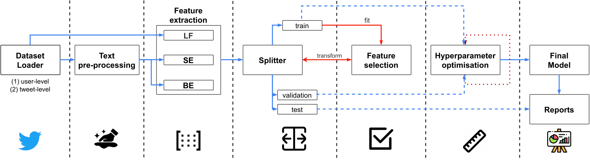

# Spanish PoliCorpus 2020
## Psychographic Traits Identification Based on Political Ideology: A Behaviour Analysis Study on Spanish Politicians' Tweets Posted in 2020  
https://www.sciencedirect.com/science/article/pii/S0167739X21004921

### TL-DR: Highlights
- Creation of a **Spanish dataset** containing political tweets authored by official Spanish politicians during 2020.
- Annotation and computational modelling of **political ideology** (left-wing vs. right-wing) from textual and behavioural signals.
- Exploration of **psychographic traits** and behavioural cues in political communication on social media.
- Evaluation of multiple machine learning and deep learning models using linguistic, semantic, and interaction-level features.
- Identification of discriminative linguistic patterns that correlate strongly with political ideology.

### Authors
- **José Antonio García-Díaz** — University of Murcia  
  [Google Scholar](https://scholar.google.es/citations?user=ek7NIYUAAAAJ) · [ORCID](https://orcid.org/0000-0002-3651-2660)

- **Ricardo Colomo-Palacios** — Østfold University College  
  [Google Scholar](https://scholar.google.es/citations?user=CpqizXUAAAAJ&hl=es) · [ORCID](https://orcid.org/0000-0002-1555-9726)

- **Rafael Valencia-García** — University of Murcia  
  [Google Scholar](https://scholar.google.com/citations?user=GLpBPNMAAAAJ) · [ORCID](https://orcid.org/0000-0003-2457-1791)

> Affiliations:
> - *Departamento de Informática y Sistemas, Universidad de Murcia, Spain*  
> - *Faculty of Computer Sciences, Østfold University College, Norway*

### Publication
This article was published in *Future Generation Computer Systems (FGCS)*, Volume 129, November 2021, Pages 138–152.  
**DOI:** https://doi.org/10.1016/j.future.2021.01.015  
**Publisher page:** https://www.sciencedirect.com/science/article/pii/S0167739X21004921

---

### Abstract
Political ideology strongly shapes how individuals interpret, communicate, and engage with political content online. In this study, we present a novel dataset composed of tweets published in 2020 by official Spanish politicians, labelled according to their political ideology. Using this corpus, we explore the extent to which linguistic, semantic, psychographic, and behavioural features can reveal ideological leaning. We evaluate a broad range of machine learning and deep learning models and analyse the psychographic traits associated with ideological groups. Our results show that several linguistic patterns and interaction-level behaviours provide robust signals for political ideology classification, enabling richer understanding of political communication in social media environments.

#### Relation to Shared Tasks
Part of this dataset was used as the foundation for the **PoliticES 2022** shared task on political ideology detection in Spanish, organised within IberLEF.  
The task description and results are available in the SEPLN journal:

- PoliticES 2022 overview: http://journal.sepln.org/sepln/ojs/ojs/index.php/pln/article/view/6446  
- CodaLab competition page: https://codalab.lisn.upsaclay.fr/competitions/1948

This shared task helped benchmark the dataset in a competitive evaluation setting, providing further validation of its usefulness for political ideology and author profiling research.


---

### Dataset
This repository provides access to the **Spanish Political Ideology Corpus**, containing labelled tweets from verified Spanish politicians.

Each instance includes:
- The text of the tweet  
- Metadata (author, date, retweets, interactions)  
- The manually annotated *political ideology* of the author  
- Additional psychographic traits used for analysis  
- Preprocessed and raw text files

#### Dataset distribution
Next, we show the label distribution per trait.

##### Demographic trait: gender
| Trait        | Class   | Total | Train | Val | Test |
|--------------|---------|------:|------:|----:|-----:|
| Gender       | female  | 113   | 67    | 23  | 23   |
|              | male    | 156   | 99    | 29  | 28   |

##### Demographic trait: age range
| Trait        | Class   | Total | Train | Val | Test |
|--------------|---------|------:|------:|----:|-----:|
| Age          | 25-34   | 28    | 21    | 1   | 6    |
|              | 35-49   | 126   | 80    | 23  | 23   |
|              | 50-64   | 104   | 57    | 26  | 21   |
|              | over 65 | 11    | 8     | 2   | 1    |

##### Psychograph trait: political spectrum (binary)
| Trait        | Class   | Total | Train | Val | Test |
|--------------|---------|------:|------:|----:|-----:|
| Spectrum     | left    | 146   | 88    | 31  | 27   |
| (binary)     | right   | 123   | 78    | 21  | 24   |
| Spectrum     | left    | 56    | 37    | 12  | 7    |
| (multiclass) | m-left  | 90    | 51    | 19  | 20   |
|              | m-right | 83    | 54    | 15  | 14   |
|              | right   | 39    | 23    | 6   | 10   |


##### Psychograph trait: political spectrum of journalists (used for evaluation)
| Trait        | Class   | Total | Train | Val | Test |
|--------------|---------|------:|------:|----:|-----:|
| Spectrum     | left    | 31    | -     | -   | 31   |
| (binary)     | right   | 20    | -     | -   | 20   |

| Trait        | Class   | Total | Train | Val | Test |
|--------------|---------|------:|------:|----:|-----:|
| Spectrum     | left    | 20    | -     | -   | 20   |
| (multiclass) | m-left  | 11    | -     | -   | 11   |
|              | m-right | 13    | -     | -   | 13   |
|              | right   | 7     | -     | -   | 7    |

### Access
Because the dataset contains posts from identifiable politicians, access requires academic use consent.

To request access, please complete the following form:
```TBD```

Once validated, you will receive download instructions by email.

## Architecture



## Evaluation Summary
The article evaluates several models including:

- Logistic Regression  
- SVM  
- Random Forest  
- LSTM and BiLSTM architectures  
- Transformer-based sentence embeddings  
- Psychographic and metadata-driven features  

The best performing models combine textual features with behavioural metadata, confirming that ideology can be inferred not only from language but also from patterns of interaction, self-presentation, and posting behaviour.


### Acknowledgments
This paper is part of the research project **LaTe4PSP (PID2019-107652RB-I00)** funded by *MCIN/AEI/10.13039/501100011033*. In addition, José Antonio García-Díaz was supported by **Banco Santander** and the **University of Murcia** through the *Doctorado industrial programme*.  

### Citation
```
@article{garcia2022psychographic,
  title={Psychographic traits identification based on political ideology: An author analysis study on spanish politicians’ tweets posted in 2020},
  author={Garc{\'\i}a-D{\'\i}az, Jos{\'e} Antonio and Colomo-Palacios, Ricardo and Valencia-Garc{\'\i}a, Rafael},
  journal={Future Generation Computer Systems},
  volume={130},
  pages={59--74},
  year={2022},
  publisher={Elsevier}
}
```
